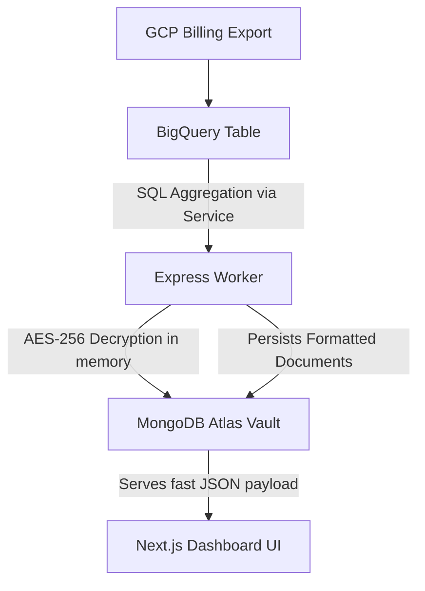

<div align="center">
  
  <h1>CloudLens Microservice Backend</h1>
  <p>The core intelligence engine behind CloudLens. Encrypts credentials securely and syncs heavy BigQuery data exports down to MongoDB so the frontend dashboard flies.</p>
</div>

---

## ⚡ Why Build a Dedicated Sync Engine?

Running large SQL aggregations directly on the frontend is a recipe for slow dashboards and exhausted API quotas. **CloudLens** uses this Node.js microservice as a standalone worker to solve that problem.

This backend connects securely to multiple tenants (client GCP accounts), fetches their billing history via the BigQuery API, groups costs hierarchically (Project &rarr; Service &rarr; SKU), and upserts them into MongoDB Atlas. The `node-cron` scheduler ensures that the dashboard data is always fresh, updating every 6 hours without maxing out BigQuery limits.

## 🔐 Advanced Security
When users add a cloud integration, this service doesn't just store the JSON string in plaintext. We utilize **AES-256-CBC encryption** on the backend using an environment-level secret key (`ENCRYPTION_KEY`). The service account JSON is completely encrypted at rest in MongoDB. When a sync job fires, the credentials are decrypted completely in memory, used for the API call, and destroyed.

## 🛠️ The Technology Stack

- **Runtime**: Node.js
- **Framework**: Express.js
- **Language**: TypeScript
- **Database**: MongoDB Atlas (via Mongoose)
- **Vendors**: `@google-cloud/bigquery` SDK
- **Task Scheduling**: `node-cron` for automated data syncing
- **Cryptography**: Node's native `crypto` module

## 📡 Core API Endpoints

| Method | Route | Purpose |
| ------ | ----- | ------- |
| `GET` | `/health` | Server heartbeats and uptime monitoring |
| `POST` | `/api/settings/cloud-accounts` | Encrypts and securely vaults GCP Service Account JSON keys |
| `GET` | `/api/billing?projectId=123` | Returns hierarchical, pre-aggregated billing data for the frontend graphs |
| `POST` | `/api/worker/sync` | Manually triggers the BigQuery SQL pull & MongoDB sync (also runs hourly via cron) |

## 🏗️ Getting Started

1. Clone this repository
   ```bash
   git clone https://github.com/your-username/cloudlens-backend.git
   ```
2. Install dependencies
   ```bash
   npm install
   ```
3. Create your local environment file
   ```bash
   cp .env.example .env
   ```
4. Fill out the `.env` values
   - Provide a valid `MONGODB_URI` string to your Atlas cluster.
   - Run `node -e "console.log(require('crypto').randomBytes(32).toString('hex'))"` to generate a secure `ENCRYPTION_KEY`.
5. Run the dev server
   ```bash
   npm run dev
   ```
6. The service is now listening on **http://localhost:8000**

---

### Sync Flow Architecture



## 🤝 Contributing

We welcome contributions! Open issues, submit PRs, and help us make cloud finance legible for everyone.

## 📄 License

This project is licensed under the MIT License - see the [LICENSE](LICENSE) file for details.
